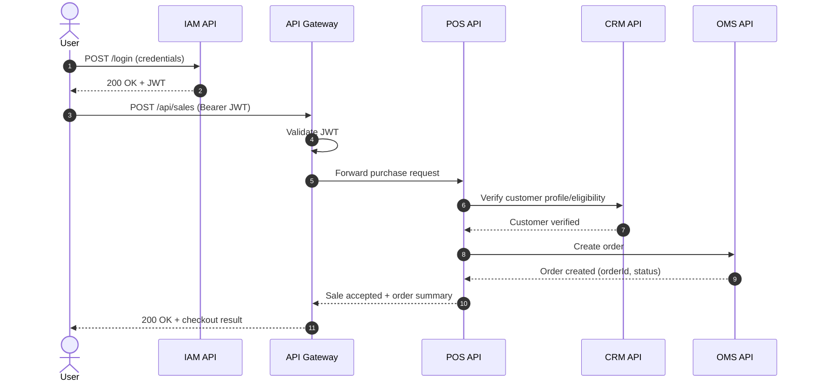
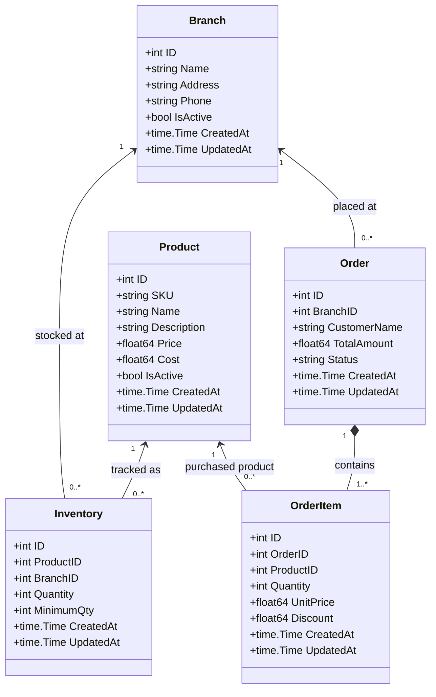
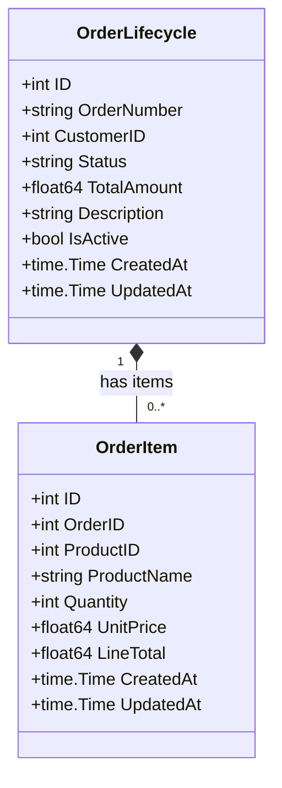
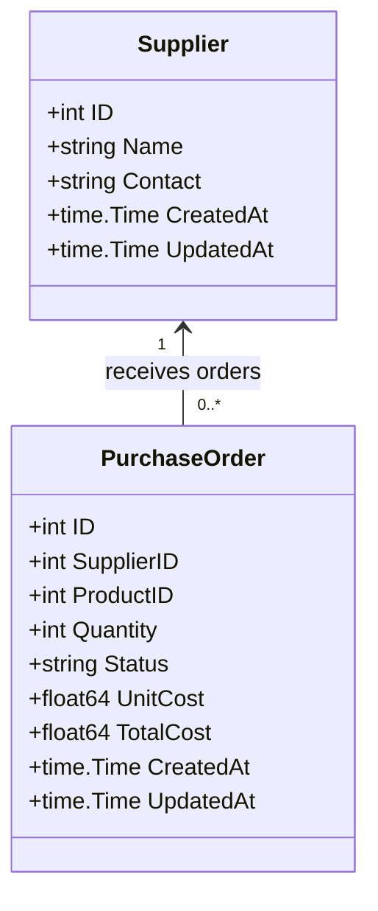
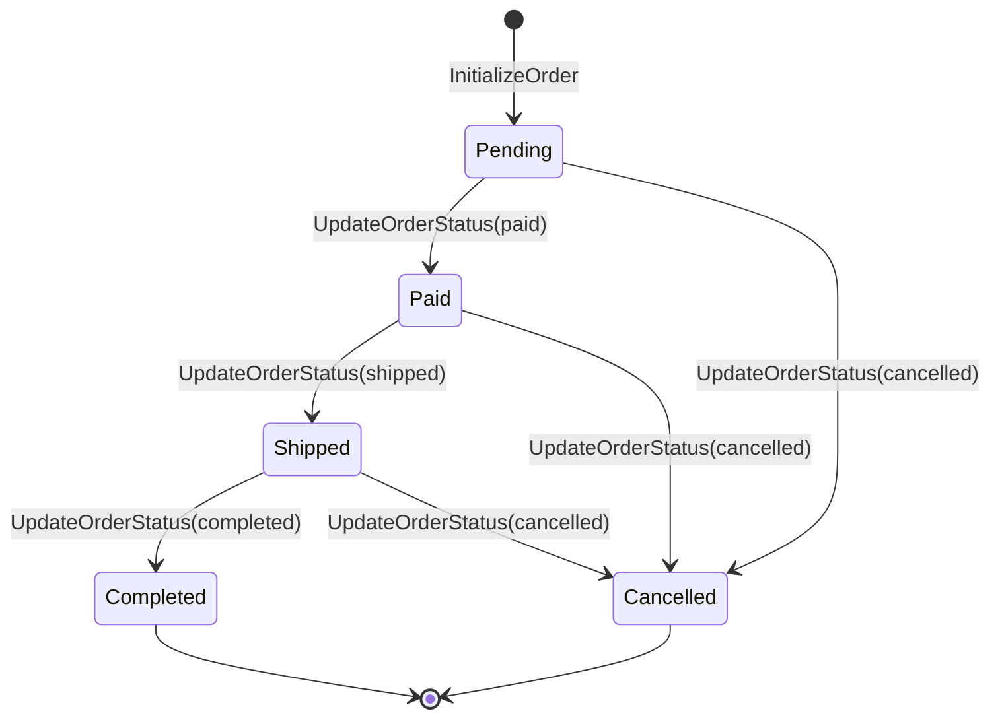
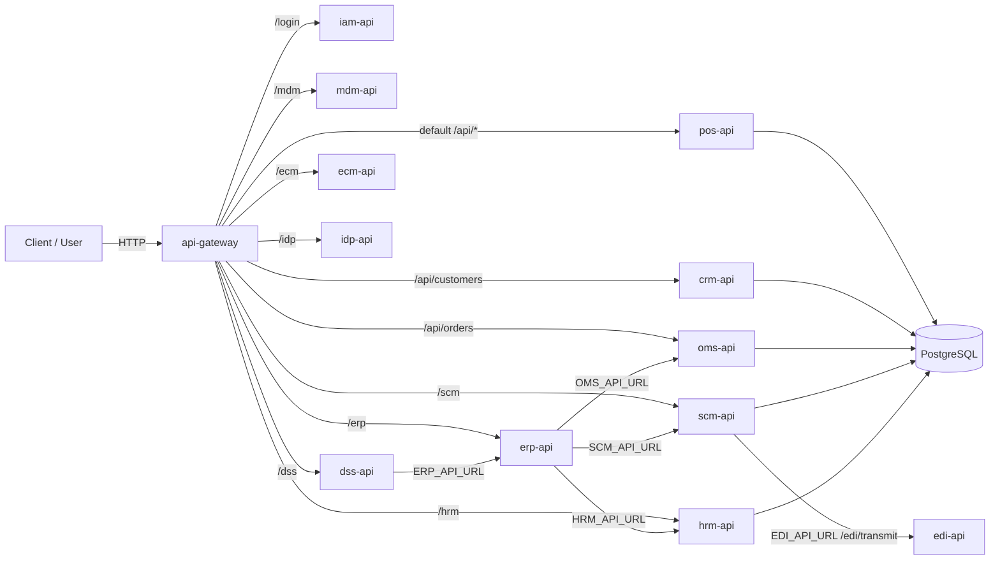

# Architecture Diagrams

## STEP 1: Global Sequence Diagram (Checkout Flow)

## STEP 2: Domain Class Diagrams (Core Entities)

### pos-api

### oms-api

### scm-api

## STEP 3: State Diagram (Order Lifecycle)

## STEP 4: High-Level System Architecture Diagram

