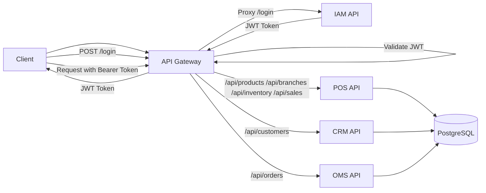
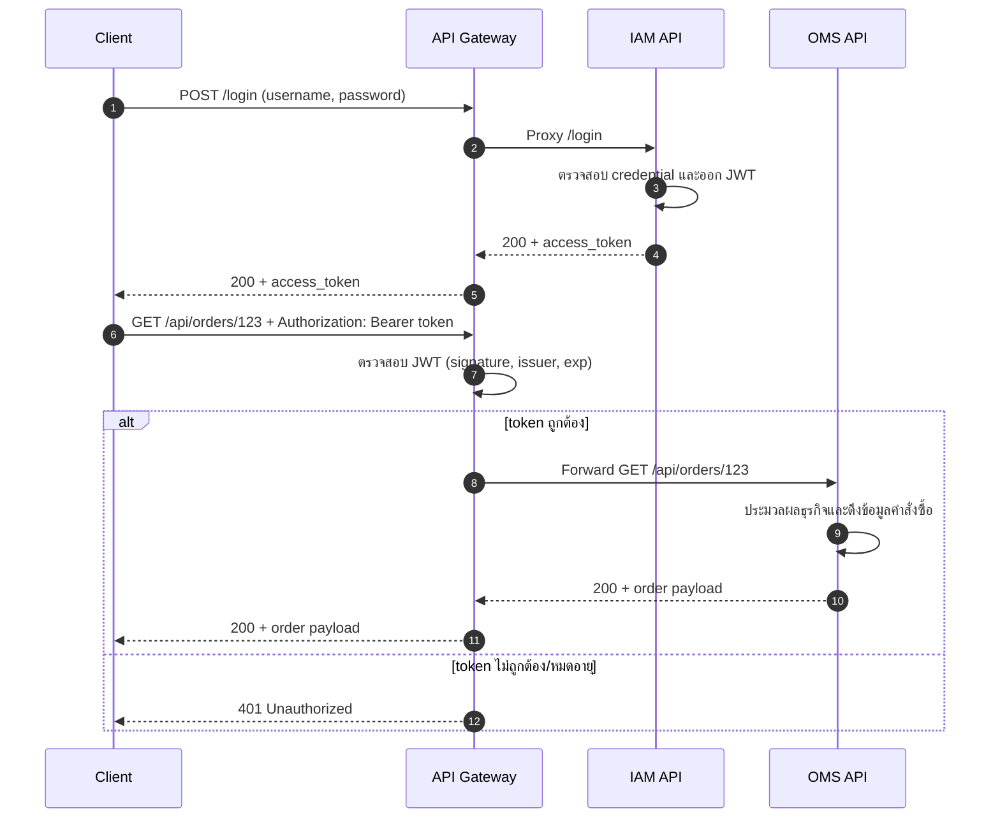
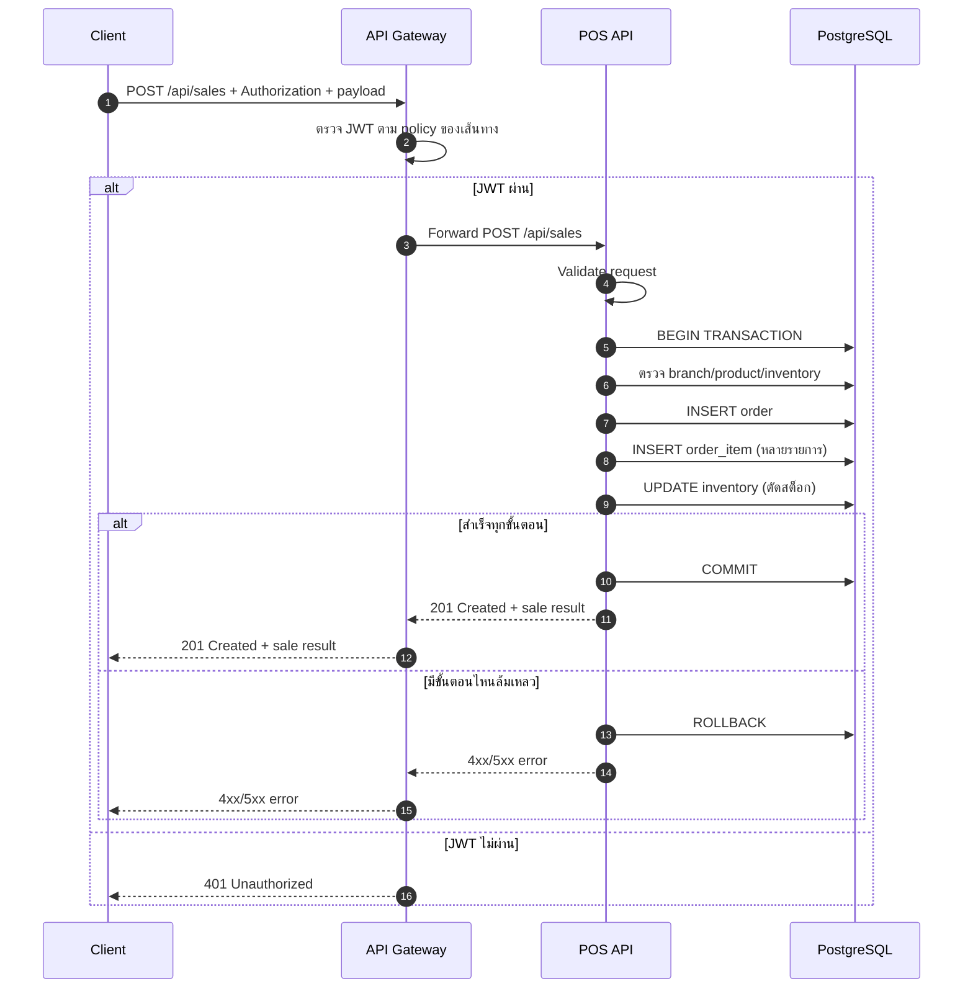
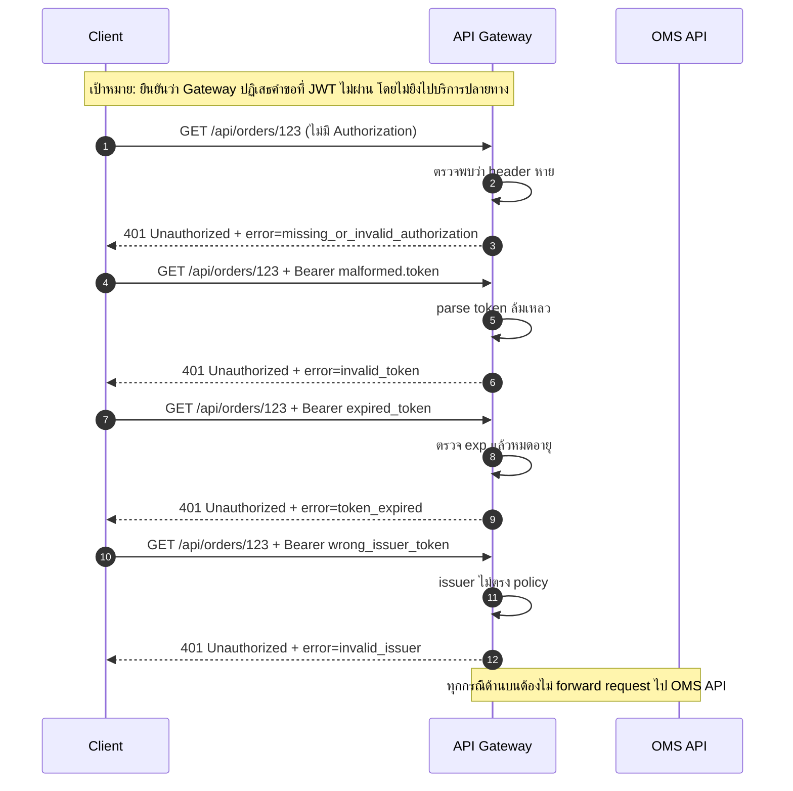

# เอกสารส่งมอบ STEP 2: โครงสร้างโปรเจ็กต์ Go และการแมปโมเดลกับตาราง

เอกสารนี้เป็นฉบับสรุปแบบอ่านง่ายสำหรับ STEP 2 โดยเน้น 2 ส่วนหลัก:
- โครงสร้าง Monorepo ที่มีอยู่จริง
- การแมป Go Model กับตารางในฐานข้อมูล

## 1) โครงสร้างโปรเจ็กต์จริง (เฉพาะส่วนสำคัญของระบบ)

```text
POS_Basis_WMS/
├── cmd/
│   └── loadbot/
├── docs/
├── migrations/
├── observability/
│   └── grafana/
│       └── provisioning/
├── pkg/
│   ├── config/
│   └── observability/
├── services/
│   ├── api-gateway/
│   │   └── cmd/api/
│   ├── crm-api/
│   │   ├── cmd/api/
│   │   └── internal/
│   │       ├── domain/
│   │       ├── handler/
│   │       ├── repository/
│   │       └── service/
│   ├── iam-api/
│   │   ├── cmd/api/
│   │   └── internal/
│   │       ├── domain/
│   │       ├── handler/
│   │       └── service/
│   ├── oms-api/
│   │   ├── cmd/api/
│   │   └── internal/
│   │       ├── domain/
│   │       ├── handler/
│   │       ├── repository/
│   │       └── service/
│   └── pos-api/
│       ├── cmd/api/
│       └── internal/
│           ├── domain/
│           ├── handler/
│           ├── repository/
│           └── service/
├── docker-compose.yml
├── go.mod
├── README.md
└── schema.sql
```

## 2) การแมป Go Model กับตารางฐานข้อมูล

แหล่งอ้างอิงโครงสร้างตารางหลักคือไฟล์ schema.sql

| ตารางฐานข้อมูล    | Go Model หลัก   | Service ที่ใช้งาน | ตำแหน่งไฟล์ Model                             |
| --------------- | -------------- | -------------- | ------------------------------------------ |
| product         | Product        | pos-api        | services/pos-api/internal/domain/models.go |
| branch          | Branch         | pos-api        | services/pos-api/internal/domain/models.go |
| inventory       | Inventory      | pos-api        | services/pos-api/internal/domain/models.go |
| order           | Order          | pos-api        | services/pos-api/internal/domain/models.go |
| order_item      | OrderItem      | pos-api        | services/pos-api/internal/domain/models.go |
| customer        | Customer       | crm-api        | services/crm-api/internal/domain/models.go |
| order_lifecycle | OrderLifecycle | oms-api        | services/oms-api/internal/domain/models.go |
| order_item_oms  | OrderItem      | oms-api        | services/oms-api/internal/domain/models.go |

## 3) หมายเหตุการแมปที่สำคัญ (สรุปสั้น)

- ตาราง order ต้องใส่เครื่องหมายอัญประกาศคู่ใน SQL เพราะเป็นคำสงวนของ PostgreSQL
- ตาราง order_item_oms แมปกับโมเดล OrderItem ฝั่ง OMS โดยแยกจาก OrderItem ฝั่ง POS ชัดเจน
- ความสัมพันธ์ข้ามบริการที่ถูกคุมด้วย Foreign Key มีอย่างน้อย:
  - order_lifecycle.customer_id -> customer.id
  - order_item_oms.product_id -> product.id

## 4) ยืนยันการแยกเลเยอร์ของบริการหลัก

บริการหลักฝั่งธุรกิจใช้รูปแบบเลเยอร์ตามนี้:

handler -> service -> repository -> PostgreSQL

บริการที่ใช้รูปแบบนี้:
- pos-api
- crm-api
- oms-api

บริการขอบระบบ (Edge Services):
- api-gateway: ทำ reverse proxy และตรวจ JWT สำหรับเส้นทางที่ป้องกัน
- iam-api: ทำ authentication และออก JWT

## 5) แผนภาพการไหลของ Request ระหว่าง Gateway, IAM, POS, CRM, OMS



หมายเหตุ:
- เส้นทาง /login ไม่ต้องใช้ JWT เพื่อให้ client ขอ token ได้
- เส้นทาง protected จะถูกตรวจ JWT ที่ API Gateway ก่อนส่งต่อ
- ทั้ง POS, CRM, OMS เข้าถึงฐานข้อมูล PostgreSQL เดียวกันใน MVP ปัจจุบัน

## 6) Sequence Diagram: กรณีใช้งานหลัก

### 6.1 Login แล้วเรียก Protected Endpoint



### 6.2 เรียก /api/sales ผ่าน Gateway จนถึงฐานข้อมูล



### 6.3 JWT ไม่ถูกต้อง/หมดอายุ (Error-First สำหรับ QA)



เช็กลิสต์ QA ที่ผูกกับแผนภาพนี้:
- ทุกเคสต้องได้ HTTP 401
- response body ต้องมี success=false และ error code ที่สื่อความชัดเจน
- OMS API ต้องไม่ถูกเรียกเมื่อ JWT ไม่ผ่าน (ตรวจจาก access log หรือ metrics)
- เมื่อใช้ token ที่ถูกต้อง ต้องผ่าน gateway และไปถึง OMS API ได้ตามปกติ (เป็น control case)

## 7) Test Case Template (พร้อมคัดลอกใช้งาน)

ส่วนนี้ออกแบบให้ใช้ได้ทันทีทั้ง 2 แบบ:
- QA test sheet (Markdown table)
- Postman (Request + Tests script)

### 7.1 QA Test Sheet Template (Markdown)

ให้คัดลอกตารางนี้ไปใช้ในไฟล์ทดสอบได้ทันที

| TC_ID    | ประเภท           | กรณีทดสอบ                  | Precondition                    | Method | Endpoint        | Headers                                    | Body | Expected Status | Expected Response (ย่อ)                                                     | ตรวจ Non-Forward                | ผลลัพธ์จริง | หมายเหตุ            |
| -------- | ---------------- | ------------------------- | ------------------------------- | ------ | --------------- | ------------------------------------------ | ---- | --------------- | -------------------------------------------------------------------------- | ------------------------------- | -------- | ------------------ |
| AUTH-001 | Negative         | ไม่มี Authorization header  | ระบบ Gateway/OMS ทำงานปกติ        | GET    | /api/orders/123 | -                                          | -    | 401             | success=false, error=missing_or_invalid_authorization                      | OMS access log ต้องไม่มี request นี้ |          |                    |
| AUTH-002 | Negative         | Bearer token malformed    | ระบบ Gateway/OMS ทำงานปกติ        | GET    | /api/orders/123 | Authorization: Bearer malformed.token      | -    | 401             | success=false, error=invalid_token                                         | OMS access log ต้องไม่มี request นี้ |          |                    |
| AUTH-003 | Negative         | Bearer token หมดอายุ       | มี expired token                 | GET    | /api/orders/123 | Authorization: Bearer <expired_token>      | -    | 401             | success=false, error=token_expired (หรือ invalid_token ตาม implementation)  | OMS access log ต้องไม่มี request นี้ |          |                    |
| AUTH-004 | Negative         | Bearer token issuer ไม่ตรง | มี token ที่ issuer ไม่ตรงกับ policy | GET    | /api/orders/123 | Authorization: Bearer <wrong_issuer_token> | -    | 401             | success=false, error=invalid_issuer (หรือ invalid_token ตาม implementation) | OMS access log ต้องไม่มี request นี้ |          |                    |
| AUTH-005 | Positive Control | Bearer token ถูกต้อง        | มี valid token จาก /login        | GET    | /api/orders/123 | Authorization: Bearer <valid_token>        | -    | 200/404*        | ผ่าน Gateway และถูก forward ไป OMS                                           | OMS access log ต้องพบ request นี้  |          | *ขึ้นกับข้อมูลจริงในระบบ |

### 7.2 QA Test Sheet Template (CSV)

คัดลอกไปวางใน Excel/Google Sheets ได้ทันที

```csv
TC_ID,ประเภท,กรณีทดสอบ,Precondition,Method,Endpoint,Headers,Body,Expected Status,Expected Response (ย่อ),ตรวจ Non-Forward,ผลลัพธ์จริง,หมายเหตุ
AUTH-001,Negative,ไม่มี Authorization header,ระบบ Gateway/OMS ทำงานปกติ,GET,/api/orders/123,-,-,401,"success=false,error=missing_or_invalid_authorization","OMS access log ต้องไม่มี request นี้",,
AUTH-002,Negative,Bearer token malformed,ระบบ Gateway/OMS ทำงานปกติ,GET,/api/orders/123,"Authorization: Bearer malformed.token",-,401,"success=false,error=invalid_token","OMS access log ต้องไม่มี request นี้",,
AUTH-003,Negative,Bearer token หมดอายุ,มี expired token,GET,/api/orders/123,"Authorization: Bearer <expired_token>",-,401,"success=false,error=token_expired หรือ invalid_token","OMS access log ต้องไม่มี request นี้",,
AUTH-004,Negative,Bearer token issuer ไม่ตรง,มี token issuer ไม่ตรง,GET,/api/orders/123,"Authorization: Bearer <wrong_issuer_token>",-,401,"success=false,error=invalid_issuer หรือ invalid_token","OMS access log ต้องไม่มี request นี้",,
AUTH-005,Positive Control,Bearer token ถูกต้อง,มี valid token จาก /login,GET,/api/orders/123,"Authorization: Bearer <valid_token>",-,"200 หรือ 404","request ถูก forward ไป OMS","OMS access log ต้องพบ request นี้",,
```

### 7.3 Postman Template: Request Collection (แนะนำ)

ตั้งค่าเบื้องต้นใน Collection Variables:
- base_url = http://localhost:8080
- valid_token = <ใส่หลัง login>
- expired_token = <token ที่หมดอายุ>
- wrong_issuer_token = <token issuer ไม่ถูกต้อง>

ตัวอย่าง request template:

1) AUTH-001 No Authorization Header
- Method: GET
- URL: {{base_url}}/api/orders/123
- Header: (ไม่ใส่ Authorization)

2) AUTH-002 Malformed Token
- Method: GET
- URL: {{base_url}}/api/orders/123
- Header: Authorization: Bearer malformed.token

3) AUTH-003 Expired Token
- Method: GET
- URL: {{base_url}}/api/orders/123
- Header: Authorization: Bearer {{expired_token}}

4) AUTH-004 Wrong Issuer Token
- Method: GET
- URL: {{base_url}}/api/orders/123
- Header: Authorization: Bearer {{wrong_issuer_token}}

5) AUTH-005 Valid Token (Control)
- Method: GET
- URL: {{base_url}}/api/orders/123
- Header: Authorization: Bearer {{valid_token}}

### 7.4 Postman Tests Script Template (คัดลอกใช้ได้ทันที)

สคริปต์กลางสำหรับเคส negative (คาดหวัง 401):

```javascript
pm.test('Status code is 401', function () {
  pm.response.to.have.status(401);
});

pm.test('Response has success=false', function () {
  const body = pm.response.json();
  pm.expect(body.success).to.eql(false);
});

pm.test('Response contains error field', function () {
  const body = pm.response.json();
  pm.expect(body).to.have.property('error');
  pm.expect(body.error).to.be.a('string').and.not.empty;
});
```

สคริปต์กลางสำหรับ control case (valid token):

```javascript
pm.test('Status is forwarded from upstream (not 401)', function () {
  pm.expect(pm.response.code).to.not.eql(401);
});

pm.test('Gateway accepted valid token', function () {
  pm.expect([200, 404, 400, 422]).to.include(pm.response.code);
});
```

หมายเหตุสำหรับทีม QA:
- ถ้าข้อความ error จริงต่างจาก template เล็กน้อย ให้ยึดหลักการสำคัญคือสถานะ 401 + ไม่ถูก forward
- เคส AUTH-005 เป็น control case เพื่อยืนยันว่า policy ไม่ได้บล็อกทุกคำขอ
