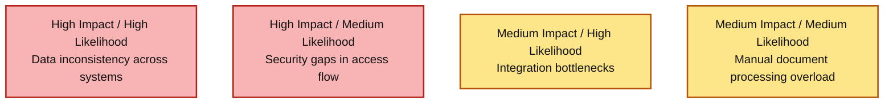
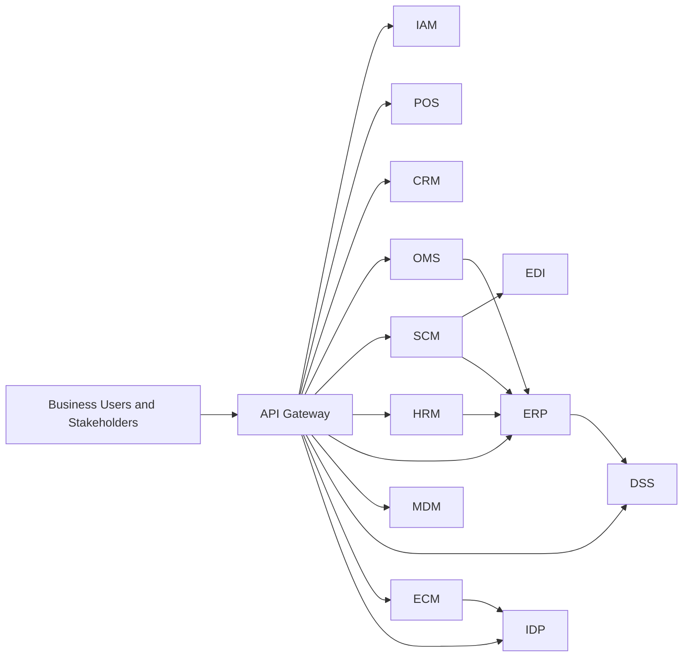

# Executive Summary - Enterprise MultiSystem MVP

เอกสารนี้สรุประดับผู้บริหารสำหรับ stakeholder ที่ไม่เน้นเทคนิค โดยอธิบายว่าโปรเจกต์นี้ถูกสร้างขึ้นแบบ vibe coding เพื่อจำลองการออกแบบ enterprise multisystem MVP ด้วย Golang และ microservices เพื่อทดสอบความพร้อมเชิงธุรกิจก่อนขยายจริง

## 1) Business Intent
- เป้าหมายหลัก: ทำ MVP ที่เชื่อมงานขาย, ลูกค้า, คำสั่งซื้อ, จัดซื้อ, บุคลากร, การเงิน, เอกสาร, และ insight ให้อยู่ใน ecosystem เดียว
- คุณค่าที่องค์กรได้รับ: มองเห็นข้อมูลปลายทางถึงปลายทาง (end-to-end) ตั้งแต่การขายจนถึงการตัดสินใจผู้บริหาร
- ขอบเขต MVP: โฟกัสความเร็วในการเรียนรู้ระบบองค์กร มากกว่าความสมบูรณ์ระดับ production ทุกมิติ

## 2) Systems at a Glance
| Domain | Systems | Business Role |
|---|---|---|
| Access and Entry | API Gateway, IAM | ควบคุมการเข้าถึงและจุดเข้าใช้งานรวม |
| Commerce Core | POS, CRM, OMS | ขายสินค้า, เข้าใจลูกค้า, ติดตามคำสั่งซื้อ |
| Supply and Cost | SCM, EDI | เติมสินค้าและประสานคู่ค้าภายนอก |
| Workforce and Finance | HRM, ERP | สรุปต้นทุนบุคลากรและภาพรวมการเงิน |
| Data and Intelligence | MDM, DSS | ยกระดับคุณภาพข้อมูลและสร้าง insight |
| Content and Automation | ECM, IDP | จัดการเอกสารและสกัดข้อมูลอัตโนมัติ |

## 3) Executive Value in Plain Language
- Revenue confidence: ผู้บริหารเห็นภาพการขายและคำสั่งซื้อเชื่อมกับต้นทุน
- Cost transparency: ต้นทุนจัดซื้อและบุคลากรถูกรวมเพื่อมองกำไรจริง
- Operational control: แต่ละทีมมี owner ชัดและ KPI ใช้วัดผลได้
- Decision speed: มี DSS ช่วยแปลข้อมูลเป็นสัญญาณตัดสินใจ

## 4) KPI Baseline and Targets (Monthly/Quarterly)
| Executive Theme | KPI | Baseline (Last Month) | Monthly Target | Quarterly Target |
|---|---|---|---|---|
| Reliability | End-to-end transaction success | 96.9% | >= 98.0% | >= 99.0% |
| Growth | Repeat purchase rate | 26% | >= 28% | >= 31% |
| Cost Control | Purchase cost variance | 7.2% | <= 5.5% | <= 4.0% |
| Workforce Efficiency | Payroll summary accuracy | 98.4% | >= 99.0% | >= 99.5% |
| Data Trust | Master-data validation pass rate | 89% | >= 93% | >= 96% |
| Decision Effectiveness | Insight adoption in monthly review | 58% | >= 68% | >= 78% |

## 5) Top Enterprise Risks and Mitigations
| Risk | Why executives should care | Mitigation Direction |
|---|---|---|
| Data inconsistency across systems | ทำให้รายงานการเงินและการตัดสินใจคลาดเคลื่อน | Data contracts, MDM governance, reconciliation |
| Integration bottlenecks | กระทบความเร็วการขยายธุรกิจและ partner onboarding | API standards, integration ownership, SLOs |
| Security gaps in access flow | เสี่ยงต่อข้อมูลสำคัญและ compliance | Strong IAM policy, token lifecycle, audit logs |
| Manual document processing overload | ทำให้ back-office ช้าและต้นทุนสูง | ECM + IDP with human-in-the-loop quality gates |

### Risk Heatmap (Executive View)

## 6) 90-Day Enterprise Readiness Priorities
1. Operationalize KPIs: สร้าง dashboard กลางของ KPI หลักที่ผูก owner และ review cadence
2. Standardize data contracts: กำหนด schema governance ข้าม POS/OMS/SCM/HRM/ERP
3. Strengthen identity and controls: เพิ่ม policy, key rotation, และ access review process
4. Improve process resilience: วาง retry/recovery path สำหรับ flows สำคัญ (order, PO, document)
5. Establish executive operating rhythm: Monthly business and risk review บนข้อมูลจาก ERP + DSS

## 7) One-Page Architecture View

## 8) What This Means for Leadership
- นี่คือ MVP ที่แสดงภาพ "enterprise operating model" ได้ครบวงจรในระดับที่ทดลองและขยายต่อได้
- หากลงทุนต่อใน data governance, security, และ process reliability ระบบนี้สามารถพัฒนาเป็น production-grade enterprise platform ได้เป็นขั้นเป็นตอน
