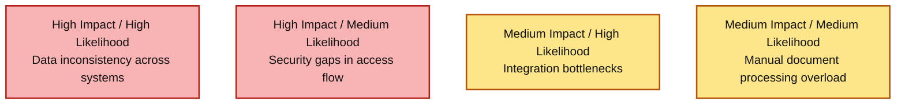
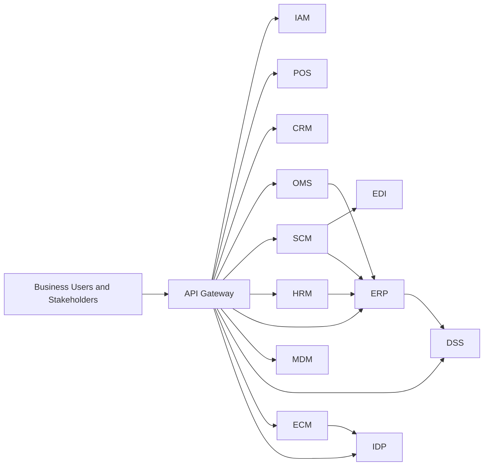

# Executive Summary - Enterprise MultiSystem MVP

This one-page summary is prepared for external, non-technical stakeholders. The project was created through vibe coding to simulate an enterprise multisystem MVP in Golang and microservices, with the goal of validating operating-model fit before full-scale rollout.

## 1) Business Intent
- Primary objective: connect sales, customer, order, procurement, workforce, finance, document, and decision intelligence into one operating ecosystem.
- Business value: enable end-to-end visibility from transaction execution to executive decision-making.
- MVP scope: optimize for learning speed and business validation, not full production completeness on day one.

## 2) Systems at a Glance
| Domain | Systems | Business Role |
|---|---|---|
| Access and Entry | API Gateway, IAM | Unified access point and identity control |
| Commerce Core | POS, CRM, OMS | Execute sales, manage customer value, track order lifecycle |
| Supply and Cost | SCM, EDI | Replenish inventory and coordinate with external suppliers |
| Workforce and Finance | HRM, ERP | Track people cost and consolidate financial performance |
| Data and Intelligence | MDM, DSS | Improve data trust and generate decision-ready insights |
| Content and Automation | ECM, IDP | Manage enterprise documents and automate data extraction |

## 3) Executive Value in Plain Language
- Revenue confidence: sales and order execution are linked to financial outcomes.
- Cost transparency: procurement and workforce costs are consolidated in one view.
- Operational control: each system has clear ownership, KPIs, and risk controls.
- Faster decisions: DSS turns operational data into actionable executive signals.

## 4) KPI Baseline and Targets (Monthly/Quarterly)
| Executive Theme | KPI | Baseline (Last Month) | Monthly Target | Quarterly Target |
|---|---|---|---|---|
| Reliability | End-to-end transaction success | 96.9% | >= 98.0% | >= 99.0% |
| Growth | Repeat purchase rate | 26% | >= 28% | >= 31% |
| Cost Control | Purchase cost variance | 7.2% | <= 5.5% | <= 4.0% |
| Workforce Efficiency | Payroll summary accuracy | 98.4% | >= 99.0% | >= 99.5% |
| Data Trust | Master-data validation pass rate | 89% | >= 93% | >= 96% |
| Decision Effectiveness | Insight adoption in monthly review | 58% | >= 68% | >= 78% |

## 5) Top Enterprise Risks and Mitigation Direction
| Risk | Why it matters | Mitigation Direction |
|---|---|---|
| Data inconsistency across systems | Inaccurate reporting can lead to poor strategic decisions | Data contracts, MDM governance, reconciliation |
| Integration bottlenecks | Slows business scaling and partner onboarding | API standards, integration ownership, SLOs |
| Security gaps in access flow | Exposes sensitive enterprise data and compliance posture | Strong IAM policy, token lifecycle, audit logs |
| Manual document processing overload | Increases back-office cost and operational delay | ECM + IDP with human-in-the-loop quality gates |

### Risk Heatmap (Executive View)

## 6) 90-Day Enterprise Readiness Priorities
1. Operationalize KPI governance with owner-level accountability and monthly review cadence.
2. Standardize cross-system data contracts for POS, OMS, SCM, HRM, and ERP.
3. Strengthen identity and access controls with key rotation and regular access reviews.
4. Improve resilience in critical flows (order, procurement, document processing).
5. Establish a fixed executive operating rhythm using ERP and DSS outputs.

## 7) One-Page Architecture View

## 8) Leadership Implication
- This MVP already demonstrates a full enterprise operating model at pilot scale.
- With focused investment in data governance, security, and reliability, the platform can be expanded to production-grade operations in phases.
