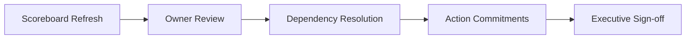

# Owner-Level KPI Scoreboard (Monthly Review)

หน้าเดียวสำหรับประชุม monthly review โดยโฟกัส owner accountability, baseline, target, และสถานะ RAG

## Monthly Scoreboard - Current Cycle

| Owner Team | Primary KPI | Baseline | Current Month | Monthly Target | Quarterly Target | Status | Priority Action |
|---|---|---:|---:|---:|---:|---|---|
| Platform Engineering | Gateway Availability (%) | 99.42 | 99.55 | 99.60 | 99.80 | Amber | Optimize routing path and autoscaling policy |
| Identity and Security | Login Success Rate (%) | 96.8 | 97.9 | 98.0 | 99.0 | Amber | Improve login error taxonomy and retry policy |
| Retail Operations Product | Checkout Success Rate (%) | 97.6 | 98.3 | 98.5 | 99.2 | Amber | Reduce checkout failure root causes by branch |
| Customer Growth | Repeat Purchase Rate (%) | 26.0 | 27.4 | 28.0 | 31.0 | Amber | Launch loyalty reactivation campaign |
| Order Orchestration | Order Lifecycle Completion (%) | 94.9 | 96.1 | 96.5 | 98.0 | Amber | Enforce idempotent status transition policy |
| Supply Planning | Stockout Rate (%) | 4.7 | 4.0 | 3.8 | 2.8 | Amber | Expedite replenishment for top-selling SKUs |
| B2B Integration | EDI Transmission Success (%) | 96.9 | 97.8 | 98.0 | 99.2 | Amber | Add partner retry and ack timeout monitoring |
| People Ops Technology | Payroll Summary Accuracy (%) | 98.4 | 98.9 | 99.0 | 99.5 | Amber | Tighten reconciliation checklist |
| Finance Systems | P&L Reconciliation Accuracy (%) | 97.9 | 98.6 | 98.8 | 99.4 | Amber | Resolve source mapping gaps |
| Data Governance | Master Data Validation Pass (%) | 89.0 | 92.5 | 93.0 | 96.0 | Amber | Fix top 3 schema validation failures |
| Decision Intelligence | Insight Adoption Rate (%) | 58.0 | 66.0 | 68.0 | 78.0 | Amber | Improve executive dashboard narrative |
| Enterprise Content Ops | Document Retrieval Time (sec) | 54.0 | 43.0 | 40.0 | 25.0 | Amber | Index metadata and tune storage retrieval |
| Intelligent Automation | IDP Extraction Accuracy (%) | 84.0 | 88.0 | 89.0 | 93.0 | Amber | Add review feedback loop to extraction model |

## Status Rules (RAG)
- Green: Current >= Monthly Target for positive KPI, or Current <= Monthly Target for inverse KPI
- Amber: Gap <= 10% from target
- Red: Gap > 10% from target

## Monthly Review Agenda (60 min)
1. 10 min: Executive snapshot (greens/ambers/reds)
2. 25 min: Red/Amber deep-dive by owner
3. 15 min: Cross-system blockers and dependencies
4. 10 min: Action owner confirmation and next-month commitments

