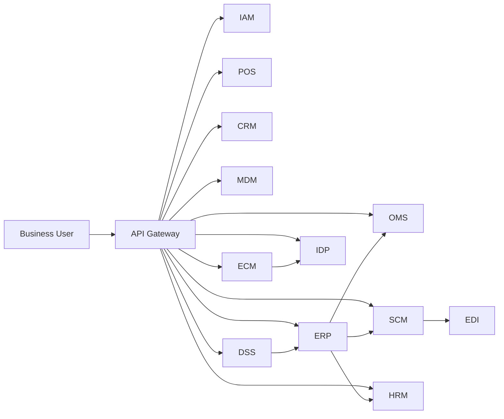

# Enterprise MultiSystem MVP Documentation

เอกสารชุดนี้อธิบายโปรเจกต์ Enterprise MultiSystem MVP ที่สร้างแบบ vibe coding เพื่อจำลองการออกแบบระบบระดับ enterprise โดยใช้ Golang เป็นแกนหลักของบริการทั้งหมด

## เอกสารนี้ตอบคำถามอะไร
- แต่ละ system คืออะไร และทำหน้าที่อะไรในธุรกิจจริง
- ถ้าระบบนี้หายไป จะเกิดผลกระทบอะไรในองค์กร
- MVP วันนี้ทำได้แค่ไหน และเมื่อโตเป็น enterprise เต็มรูปแบบควรไปทางไหน
- ระบบต่าง ๆ เชื่อมกันอย่างไรในภาพรวม

## ลิงก์รายระบบ
- [Phase 9 Documentation Focus Plan](../PHASE9_DOCS_FOCUS_PLAN.md)
- [Executive Summary for Stakeholders](./EXECUTIVE_SUMMARY.md)
- [Executive Summary (English)](./EXECUTIVE_SUMMARY_EN.md)
- [KPI Baseline Alignment Workbook](./KPI_BASELINE_ALIGNMENT.md)
- [Owner-Level KPI Scoreboard](./KPI_OWNER_SCOREBOARD.md)
- [KPI Metric Spec (Grafana/BI Ready)](./KPI_METRIC_SPEC.md)
- [Monthly Review Pack (1 Page + 5 Slides)](./MONTHLY_REVIEW_PACK.md)
- [KPI Actual Data Templates](./templates/README.md)
- [Owner Scoreboard CSV (BI Import)](./templates/kpi_owner_scoreboard_current.csv)
- [KPI SQL DDL (Dashboard Tables)](../../migrations/20260408_create_kpi_dashboard_tables.sql)
- [Grafana KPI Provisioning](../../observability/grafana/provisioning/dashboards/enterprise-kpi-dashboards.yml)
- [API Gateway](./api-gateway.md)
- [IAM (Identity and Access Management)](./iam.md)
- [POS (Point of Sale)](./pos.md)
- [CRM (Customer Relationship Management)](./crm.md)
- [OMS (Order Management System)](./oms.md)
- [SCM (Supply Chain Management)](./scm.md)
- [EDI (Electronic Data Interchange)](./edi.md)
- [HRM (Human Resource Management)](./hrm.md)
- [ERP (Enterprise Resource Planning)](./erp.md)
- [MDM (Master Data Management)](./mdm.md)
- [DSS (Decision Support System)](./dss.md)
- [ECM (Enterprise Content Management)](./ecm.md)
- [IDP (Intelligent Document Processing)](./idp.md)

## Cross-System Business Flows (MVP)
1. Login and Access Control: User ผ่าน API Gateway และ IAM ก่อนเรียกระบบธุรกิจ
2. Checkout and Order Fulfillment: POS ประสาน CRM และ OMS เพื่อสร้างคำสั่งซื้อ
3. Replenishment and Supplier Sync: SCM สร้าง PO และส่งต่อ EDI ไปคู่ค้า
4. Financial Consolidation: ERP รวบรวมยอดจาก OMS, SCM, HRM เพื่อดูภาพกำไรขาดทุน
5. Decision Intelligence: DSS ใช้ข้อมูล ERP เพื่อสร้าง insight การตัดสินใจ
6. Document Lifecycle: ECM จัดเก็บเอกสาร และ IDP สกัดข้อมูลเอกสารเพื่อใช้งานต่อ

